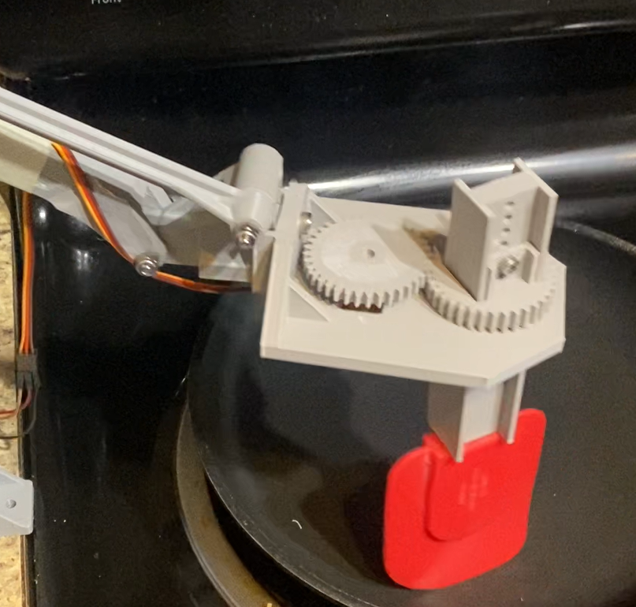
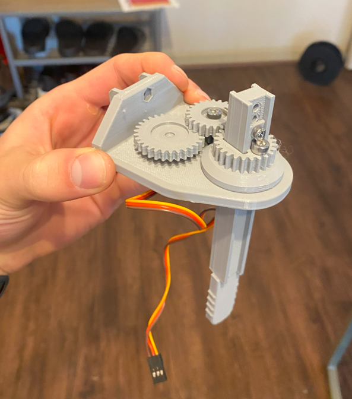

# Robot Arm Egg Scrambler

### This project is a work-in-progress

I've developed an new end effector spatula for my [previous robotic arm project](https://github.com/lujan002/EEZYbotARM-Mk2-Robot-Arm-PS4-Control), which can autonomously stir eggs in a pan. 

The first prototype utilized a 1:1 gear ratio with an SG90 servo motor, enabling a 180-degree range of motion for the spatula.

Adjusting to challenges of programming movement with only 180 degress of rotation, the second iteration introduced a 2.5:1 gear ratio to achieve a full 360-degree rotation, necessitating an upgrade to a more powerful servo due to the increased torque requirements.

I have programmed the spatula to move in a circle ensuring it remains tangent to the pan's circumference, incorporating a vertical swipe to capture any unturned eggs. Pan radius, pan center coordinates, operating height are all easily adjustable parameters. 

Future objectives include enhancing the spatula's path for consistent egg contact and integrating a machine learning-based vision system to determine when the eggs are fully cooked, automating the process from start to finish.