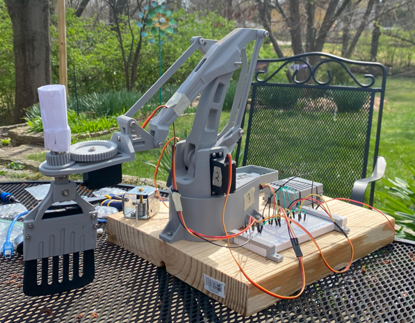
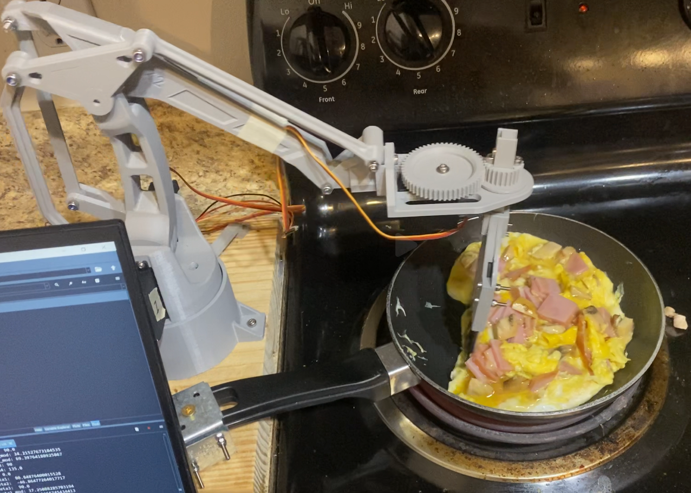
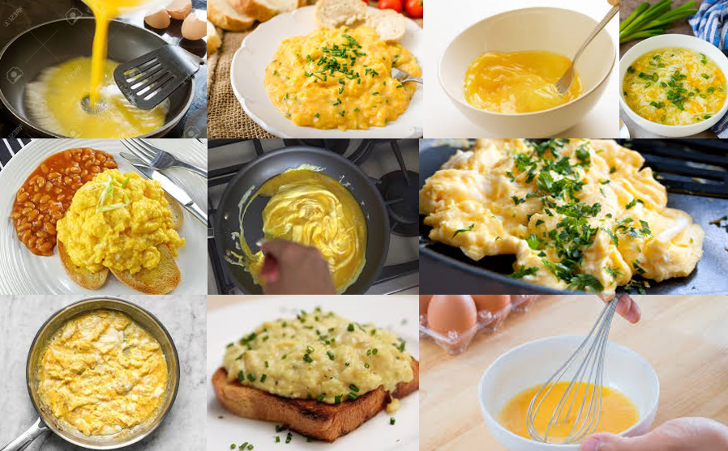

# Robot Arm Egg Scrambler

### This project is a work-in-progress

Autonomous robotic arm for srambling eggs. The work done to create the robot base is documented in my [this repository](https://github.com/lujan002/EEZYbotARM-Mk2-Robot-Arm-PS4-Control). For this modification, I've developed an new end effector spatula and programmed an optimal motion path for the end effector to reliably scramble eggs without human intervention. 

Watch the [demo video](https://www.youtube.com/watch?v=ewMSy4-Ajvs&embeds_referring_euri=https%3A%2F%2Flukejansen.carrd.co%2F&feature=emb_logo)

  
  

## Mechanical Modifications 
The first prototype utilized a 1:1 gear ratio with an SG90 servo motor, enabling a 180-degree range of motion for the spatula.

  

Adjusting to challenges of programming movement with only 180 degress of rotation, the second iteration introduced a middle gear to acheive a 2.5:1 gear ratio, thus enabling a full 360-degree rotation. This change necessitated an upgrade to a more powerful servo due to the increased torque requirements.

  

However, aligning the gears incorrectly proved to be problematic. The middle gear was not aligned with the other two, which caused increased friction and an imperfect mesh between the gears. I tried to address this by adjusting the number of teeth and the thickness of each tooth, but these changes did not resolve the issue. Ultimately, I found that removing the middle gear altogether led to a more robust design. Although this required slightly extending the base of the end effector to make space for a single, larger gear, the trade-off was well worth it for the improved performance and reliability.

## Motion Algorithm Development
For the first iteration, I programmed the spatula to move in a circle ensuring it remains tangent to the pan's circumference. During testing, I realized that the silicon spatuala insert I was using was not adequate. The spatula worked fine when the eggs were liquid, but as they began to solidify, the flexible silicone started to bend over the eggs rather than keep contact with the bottom of the pan. My solution was to replace the spatula with a more rigid one (shown at top). 

Despite this change, I still noticed that the above approach led to eggs splashing out of the pan; The eggs quickly became clumped together in front of the spatula as they started to solidify. To remedy this, the next iteration incorporated an alternating clockwise/counter-clockwise movement and a swipe down the middle of the pan at every 90 degrees that served to push the eggs towards the middle of the pan. This ensured that all the eggs would not clump together at the edge of the pan. 

For easy use on a variety of setups, the software is modular; Pan radius, pan center coordinates, spatula operating height, and speed are all easily adjustable parameters. 

## Cooked Egg Detection Software
In order to make the robot truly autonomous, a way to detect the eggs when cooked was necessary. A novel addition to this project was the task of training a machine learning CNN model to take images from a camera stream and use this to predict if the picture it sees is cooked or uncooked. I created a python script to scrape images from the web using the beutiful soup library and saved these images into "cooked" and "uncooked" directories.  

  
  

 

  Cooked Eggs Dataset Sample
&nbsp;&nbsp;&nbsp;&nbsp;&nbsp;&nbsp;&nbsp;&nbsp;&nbsp;&nbsp;&nbsp;&nbsp;&nbsp;&nbsp;&nbsp;&nbsp;&nbsp;&nbsp;&nbsp;&nbsp;&nbsp;&nbsp;&nbsp;&nbsp;&nbsp;&nbsp;&nbsp;&nbsp;&nbsp;&nbsp;&nbsp;&nbsp;&nbsp;&nbsp;&nbsp;&nbsp;&nbsp;&nbsp;&nbsp;&nbsp;&nbsp;&nbsp;&nbsp;&nbsp;&nbsp;&nbsp;
  Uncooked Eggs Dataset Sample 

Future objectives include:
Enhancing the spatula's path for consistent egg contact.
Integrating a machine learning-based vision system to determine when the eggs are fully cooked.
Fully autonomous capabilities, such as cracking eggs and turning off the stove. 

